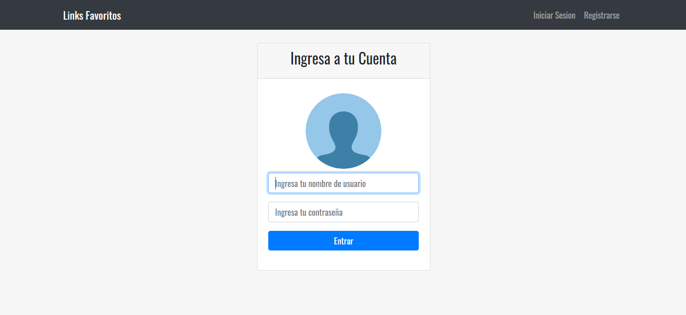

# App basica de links
App completa(login registro de usuarios y crud de links) escrita en ES6+ usando express nodejs y mysql com base de datos.
Hecha del curso de [FaztWeb](https://www.youtube.com/watch?v=qJ5R9WTW0_E)




# Instalacion 
1. Clonar el repositorio con `git clone https://github.com/MrRobotVe/nodejs-mysql-app.git` o descargar mediante el boton clone or download

2. Dependencias:
```
npm install
```

3. Correr la App:
```
npm run dev
```